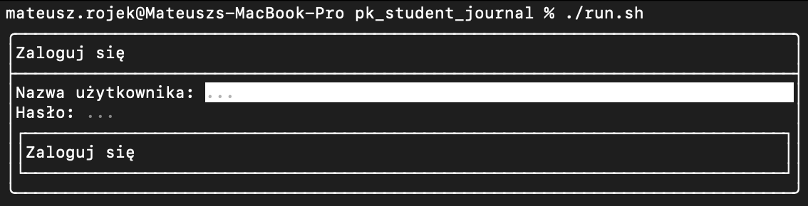
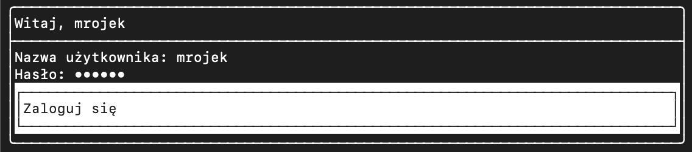
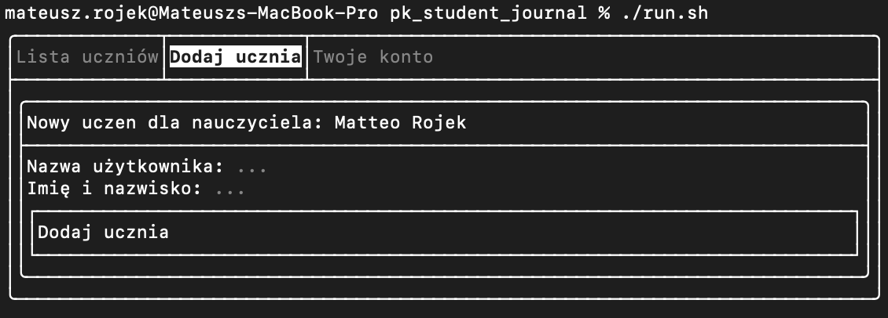
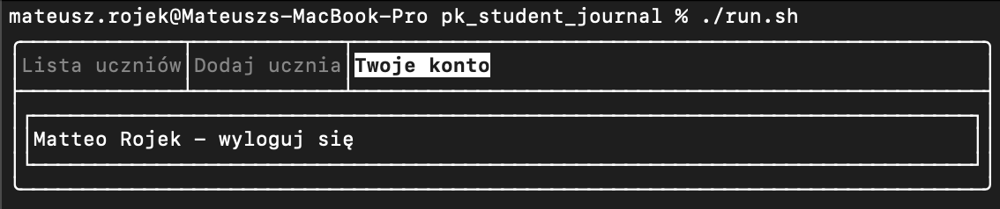

# pk_student_journal

Electronic journal design - C++ class credit assignment

## Required resources

If you don't already have a MongoDB server, install it on your computer. It is necessary for the application to work.

## Configuration

Before building the app, create a configuration file.  
Create `DatabaseConfig.cpp` file in `src/config` directory, using the template below:

```cpp
#include <includes/DatabaseConfig.h>

std::string DatabaseConfig::host = "mongodb://your_mongodb_hostname";
std::string DatabaseConfig::database = "your_mongodb_database";
```

## Build

To build the app:

```bash
  sudo chmod +x build.sh
  ./build.sh
```

## Sprawozdanie projektowe

### Temat pracy

Temat pracy: `Prosta implementacja dziennika elektronicznego` - obejmuje funkcjonalności związane z zarządzaniem listą uczniów w klasie. Projekt zakłada, że tylko nauczyciele mają uprawnienia do logowania się do systemu, a uczniowie mogą być dodawani tylko przez nauczycieli.

**Główne funkcje systemu dziennika elektronicznego:**

1. **Logowanie:**

   - System wymaga uwierzytelnienia nauczyciela przed uzyskaniem dostępu.
   - Nauczyciele posiadają specjalne uprawnienia do logowania i dostępu do funkcji administracyjnych.

2. **Zarządzanie listą uczniów:**

   - Nauczyciel ma możliwość dodawania nowych uczniów do listy.
   - Dane uczniów mogą obejmować takie informacje jak imię, nazwisko, numer identyfikacyjny itp.

3. **Przeglądanie listy uczniów:**

   - Nauczyciel ma dostęp do listy uczniów w swojej klasie.
   - Może przeglądać dane każdego ucznia, takie jak oceny, frekwencję, uwagi itp.

### Autorzy pracy

Studenci zaangażowani w stworzenie projektu:

- Mateusz Rojek
- Jakub Sermak
- Radosław Zduń
- Piotr Opyd

### Wstęp teoretyczny

Projekt ma na celu stworzenie prostej implementacji dziennika elektronicznego, który umożliwia nauczycielom efektywne zarządzanie informacjami dotyczącymi uczniów w klasie. System będzie zawierał listę uczniów z możliwością dodawania nowych wpisów. Dodatkowo, dostęp do systemu będzie ograniczony, umożliwiając logowanie tylko dla nauczycieli.

W trakcie realizacji projektu wykorzystamy następujące technologie:

- **Baza danych MongoDB:**  
Zastosujemy nierelacyjną bazę danych MongoDB do przechowywania danych uczniów, takich jak ich imię, nazwisko, numer identyfikacyjny itp. MongoDB oferuje elastyczność i skalowalność, co ułatwi nam manipulację danymi w projekcie.
- **Biblioteka użytkowa FTXUI:**  
Wykorzystamy bibliotekę FTXUI do stworzenia interfejsu użytkownika w konsoli. Dzięki temu będziemy mogli wyświetlać listę uczniów, obsługiwać interakcje z użytkownikiem i zapewnić intuicyjne korzystanie z systemu.
- **Plik CMakeLists.txt:**  
Skorzystamy z pliku CMakeLists.txt, który jest plikiem konfiguracyjnym dla narzędzia CMake. Plik ten pozwoli nam skonfigurować proces kompilacji, linkowania i budowania naszej aplikacji.
- **Język programowania C++:**  
Język C++ będzie głównym językiem programowania w projekcie. Wykorzystamy go do implementacji logiki biznesowej, obsługi bazy danych MongoDB oraz tworzenia interfejsu użytkownika przy użyciu biblioteki FTXUI.

### Opis implementacji

**Połączenie z bazą danych**  
Klasa MongoDBCollection z plikiem nagłówkowym zlokalizowanym w `includes/MongoDBCollection.h` służy jako rdzeń do połączenia z bazą danych MongoDB.

Konstruktor `MongoDBCollection(const std::string& collectionName)` inicjalizuje obiekt MongoDBCollection dla określonej kolekcji o podanej nazwie. Wewnątrz konstruktora tworzony jest klient MongoDB. Wewnątrz sprawdzamy, czy instancja nie została zdublowana.
Obiektu `MongoDBCollection` uzywamy do modyfikacji danych w bazie danych, posiada on metody do operacji na dokumentach.

**Dziedziczenie**  
Klasy `UserHandler` i `TeacherHandler` są połączone relacją dziedziczenia, gdzie klasa `TeacherHandler` dziedziczy po klasie `UserHandler`. Oznacza to, że `TeacherHandler` jest klasą pochodną, a `UserHandler` jest klasą bazową.

```cpp
class TeacherHandler : public UserHandler {
  public:
    bool checkTeacherRolePermission(const std::string& username, const std::string& password) override;
};
```

Dziedziczenie pozwala na przenoszenie właściwości i zachowań klasy bazowej do klasy pochodnej. W tym przypadku, `TeacherHandler` dziedziczy wszystkie metody publiczne i chronione z klasy `UserHandler`, takie jak `addUser()`, `removeUser()`, `doesUserExists()`, `getUserFullname()` i `checkTeacherRolePermission()`. Dziedziczenie pozwala również na dostęp do składników chronionych, takich jak `collection_`.

Ponadto, klasa `TeacherHandler` przesłania metodę `checkTeacherRolePermission()` klasy bazowej, poprzez deklarację i implementację tej samej metody z użyciem słowa kluczowego `override`. Dzięki temu, kiedy wywoływana jest metoda `checkTeacherRolePermission()` dla obiektu `TeacherHandler`, zostanie użyta wersja zdefiniowana w klasie `TeacherHandler`, a nie ta z klasy `UserHandler` (metoda z klasy `UserHandler` zawsze zwraca `false`, zaś metoda `TeacherHandler` sprawdza, czy uzytkownik faktycznie ma rolę `teacher`).

**Polimorfizm i klasy abstrakcyjne**  

Polimorfizm to jeden z podstawowych konceptów programowania obiektowego, który umożliwia traktowanie różnych obiektów na podobny sposób, opierając się na wspólnej abstrakcji. Polega na możliwości wywoływania metod na obiektach różnych klas, które dziedziczą po wspólnej klasie bazowej, ale zachowują się inaczej w zależności od swojej implementacji.

W naszym programie mamy klasę UserHandler, która zawiera kilka metod dotyczących obsługi użytkowników. Ta klasa zawiera również dwie metody wirtualne: `printUsers()` i `checkTeacherRolePermission()`, które mogą być zaimplementowane w klasach pochodnych.

Polimorfizm jest widoczny w deklaracji metod `printUsers()` i `checkTeacherRolePermission()`. Ponieważ są one zadeklarowane jako metody wirtualne, można je nadpisać w klasach pochodnych, które dziedziczą po UserHandler. Dzięki temu obiekty różnych klas pochodnych mogą być traktowane jako obiekty typu UserHandler, a metody wirtualne zostaną wywołane na nich zgodnie z ich implementacją.

Przykładem klasy pochodnej, która rozszerza UserHandler i nadpisuje metodę printUsers() jest klasa `TeacherHandler`. W pliku nagłówkowym deklarujemy nadpisanie metody:

```cpp
class TeacherHandler : public UserHandler {
public:
  void printUsers() override;
  ...
};
```

A następnie dokonujemy jej implementacji w odpowiednim pliku .cpp:
```cpp
...

void TeacherHandler::printUsers() {
  bsoncxx::builder::stream::document document{};
  document << ROLE_FIELD_KEY << "teacher";

  mongocxx::cursor cursor = collection_.find(document.view());
  for (const auto& doc : cursor) {
    std::cout << "Username: " << doc[USERNAME_FIELD_KEY].get_utf8().value << std::endl;
    std::cout << "Fullname: " << doc[FULLNAME_FIELD_KEY].get_utf8().value << std::endl;
    std::cout << "Password: " << doc[PASSWORD_FIELD_KEY].get_utf8().value << std::endl;
    std::cout << "Role: " << doc[ROLE_FIELD_KEY].get_utf8().value << std::endl;
    std::cout << "---------------------" << std::endl;
  }
}
```

Oryginalnie, w klasie `UserHandler` implementacja tej metody wygląda następująco:
```cpp
void UserHandler::printUsers() {
  collection_.printDocuments();
}
```

Mamy tutaj więc zrónicowanie w zalezności od roli uzytkownika.

**Klasy wewnętrzne**  
Klasa `Password` jest klasą wewnętrzną zdefiniowaną wewnątrz klasy `UserHandler`. Służy ona do obsługi generowania losowych haseł użytkowników. Główną funkcjonalnością tej klasy jest statyczna metoda `generateRandom()`, która generuje losowe hasło i zwraca je jako ciąg znaków.

Klasa UserHandler::Password została zaimplementowana w taki sposób, że nie jest konieczne tworzenie instancji tej klasy, aby używać metody `generateRandom()`. Można ją wywołać bezpośrednio, odwołując się do klasy i metody statycznej. Na przykład:

```cpp
std::string randomPassword = UserHandler::Password::generateRandom();
```

Wywołanie powyższego kodu spowoduje wygenerowanie losowego hasła i przypisanie go do zmiennej `randomPassword`.

Klasa `UserHandler::Password` została zaprojektowana w ten sposób, aby umożliwić łatwe i niezależne generowanie losowych haseł, które można wykorzystać w funkcjach związanych z obsługą użytkowników.

**Logi**  
Logi dotyczące wazniejszych zdarzeń zapisywane są w katalog `build` w plikach tekstowych o nazwach `logs-login.txt` (dotyczą zdarzeń logowania) oraz `logs-users.txt` (dotyczą zdarzeń tworzenia uzytkowników). Obsługiwane są przez klasę `FileLogger`, utworzoną na podstawie abstrakcyjnej klasy `Logger`.

```cpp
bool TeacherHandler::checkTeacherRolePermission(const std::string& username, const std::string& password) {
  Logger* logger = new FileLogger(LOGIN_LOGS_FILENAME);
  bool hasPermission = doesUserExists(username, password, "teacher");

  logger->log("User: " + username + " -> " + (hasPermission ? "login successful" : "false login: incorrect password or lack of permissions of the role 'teacher'"));
  delete logger;

  return hasPermission;
}
```

W implementacji funkcji `checkTeacherRolePermission`, tworzymy wskaźnik logger typu `Logger*`, który wskazuje na obiekt klasy `FileLogger`. Następnie, za pomocą tego wskaźnika, wywołujemy metodę `log()` dla logowania komunikatów. Po zakończeniu programu, zwolniamy zaalokowaną pamięć za pomocą operatora `delete`, ponieważ `Logger` jest wskaźnikiem na obiekt klasy pochodnej `FileLogger`. Zostaje wywołany destruktor, który zamyka połączenie z plikiem.

**Zrzuty ekranu - działanie programu**  

  

  

  

  